# 1. 快速使用

HCCL（Huawei Collective Communication Library）是基于昇腾AI处理器的高性能集合通信库，其主要功能与作用与Nvidia的NCCL库相似，主要用于集合通信，CANN库种自带一套测试工具用以分析集合通信性能。

## 1.1 编译环境配置

前置环境配置阶段请参考[Ascend上创建Docker](https://gitee.com/zzudongxiang/ascend.docker)，后续的所有流程均需要在具备HCCL硬件的平台上实现，需要注意的是，建议使用的Ubuntu版本大于等于20.04LTS，否则可能会遇到VSCode不支持的情况。

### 1.1.1 CANN

CANN的配置过程参考[Ascend上创建Docker](https://gitee.com/zzudongxiang/ascend.docker)文档的**安装CANN**章节，并记录安装位置，以备后续使用

完成CANN后，建议在`~/.bashrc`文件中添加对应的环境变量，例如：

```bash
# 使用nano打开~/.bashrc文件
nano ~/.bashrc
```

在文件的最后添加`export ASCEND_HOME=/usr/local/Ascend/ascend-toolkit/latest`

### 1.1.2. OpenMPI

在[OpenMPI官网](https://www.mpich.org/)找到对应版本的安装包下载，然后解压缩安装包，以`mpich-4.2.0`版本为例：

```bash
# mpich下载链接参考：https://www.mpich.org/static/downloads
wget https://www.mpich.org/static/downloads/4.2.0/mpich-4.2.0.tar.gz
# 解压缩mpich压缩包
tar -zxvf mpich-4.2.0.tar.gz
```

配置mpi的安装路径，以`/root/mpich`路径为例：

```bash
# 新建文件夹
mkdir ~/mpich
# 进入解压缩后的mpich文件夹
cd mpich-4.2.0
# 配置安装路径
./configure -prefix=/root/mpich --disable-fortran
```

使用`make`命令构建mpich的可执行文件，该过程可能耗时比较长

```bash
make
make install
```

完后后将mpich添加到环境变量种，并添加对应的链接库和帮助文件

```bash
# 修改~/.bashrc文件
nano ~/.bashrc
```

在最后一行添加以下内容：

- `export MPI_HOME=/root/mpich`
- `export PATH=$MPI_HOME/bin:$PATH`
- `export MANPATH=$MPI_HOME/man:$MANPATH`
- `export LD_LIBRARY_PATH=$MPI_HOME/lib:$LD_LIBRARY_PATH`

## 1.2 文件编译

本章节参考链接：[【昇腾】Ascend Snt9B集合通信算子单机多卡性能测试指导](https://bbs.huaweicloud.com/blogs/413870)

为了方便后续修改`hccl_test`内的文件，且保持一份未修改的源文件，建议将对应的文件复制到用户路径下，例如复制到`/root/Workdir`路径下

```bash
cp -r /usr/local/Ascend/ascend-toolkit/7.0.0/tools/hccl_test /root/Workdir/
```

由于配置的`ASCEND_HOME`指向的文件夹是一个链接，在复制`hccl_test`文件夹的时候需要复制源文件而不是文件夹链接，因此可以通过命令查看其对应的真实文件路径

```bash
# 切换到ASCEND_HOME路径
cd $ASCEND_HOME/tools
# 查看链接的真实地址
ll
```


切换到复制后的文件夹后，执行编译命令：

```bash
# 切换到复制后的文件夹中
cd /root/Workdir/hccl_test
# 编译文件
make MPI_HOME=/home/mpich ASCEND_DIR=/usr/local/Ascend/ascend-toolkit/latest
```

编译完成后会在新建的`./bin`文件夹中出现多个*_test可执行文件

## 1.3 运行测试案例

执行以下命令即可进行简单测试：

```bash
# mpirun -n 8 * 表示使用mpi拉起8个进程，建议与最后的-p参数保持一致
mpirun -n 8 ./bin/all_reduce_test -b 8 -e 2048M -f 2 -p 8
```

对应的测试配置参数及其释义如下：

```test
-b,--minbytes <min size in bytes>
-e,--maxbytes <max size in bytes>
-i,--stepbytes <increment size>
-f,--stepfactor <increment factor>
-n,--iters <iteration count>
-o,--op <sum/prod/min/max>
-d,--datatype <int8/int16/int32/fp16/fp32/int64/uint64/uint8/uint16/uint32/fp64/bfp16>
-r,--root <root>
-w,--warmup_iters <warmup iteration count>
-c,--check <result verification> 0:disabled 1:enabled.
-p,--npus <npus used for one node>
-h,--help
```

如果需要修改HCCL通信的缓冲区大小（每次HCCL通信可发送/接收的数据包大小），可以在执行之前设置环境变量`HCCL_BUFFSIZE`，单位MB，例如设置缓冲区大小为2GB：

```bash
export HCCL_BUFFSIZE=2048
```

# 2. 调试环境配置

为了方便调试和分析hccl_test编写的测试工具在运行中各个参数与之对应的实际生效作用关系，需要配置调试环境进行单步调试，通过抓取运行中的寄存器值可以看到每个参数实际对应的功能。

## 2.1 VSCode设置

VSCode需要安装`Remote-SSH`插件连接到远程服务器，插件安装过程参考其他教程，在使用`Remote-SSH`插件连接到远程服务器后需要在远程服务器上安装`C/C++`、`Jupyter`、`Python`等扩展

使用`Remote-SSH`登录到服务器上的指定文件夹，并新建`.vscode`文件夹，并在该文件夹下新建以下三个配置文件`c_cpp_properties.json`、`launch.json`、`tasks.json`

### 2.1.1 c_cpp_properties.json

该文件主要用于配置在编辑器中是否显示静态检查结果，例如部分头文件无法找到会出现红色波浪等

```json
{
    "env":{
        "ASCEND_HOME": "/usr/local/Ascend/ascend-toolkit/latest"
    },
    "configurations": [
        {
            "name": "linux-gcc-arm64",
            "includePath": [
                "${workspaceFolder}",
                "${workspaceFolder}/common/src",
                "${workspaceFolder}/common/utils",
                "${workspaceFolder}/opbase_test",
                "${MPI_HOME}/include",
                "${ASCEND_HOME}/include"
            ],
            "defines": [
                "MEM_DUMP"
            ],
            "compilerPath": "/usr/bin/gcc",
            "cStandard": "c11",
            "cppStandard": "gnu++11",
            "intelliSenseMode": "linux-gcc-arm64",
            "mergeConfigurations": false
        }
    ],
    "version": 4
}
```

- **includePath**：将代码所需的头文件路径添加到该字段下即可

### 2.1.2 launch.json

该文件主要用于配置调试器，在调试C/C++工具时需要先安装gdb工具，安装命令：`apt install gdb`

```json
{
  "configurations": [
    {
      "name": "C/C++: gcc 生成和调试活动文件",
      "type": "cppdbg",
      "request": "launch",
      "program": "${workspaceFolder}/bin/zhangdx_test",
      "args": [],
      "stopAtEntry": false,
      "cwd": "${workspaceFolder}",
      "environment": [],
      "externalConsole": false,
      "MIMode": "gdb",
      "setupCommands": [
        {
          "description": "为 gdb 启用整齐打印",
          "text": "-enable-pretty-printing",
          "ignoreFailures": true
        },
        {
          "description": "将反汇编风格设置为 Intel",
          "text": "-gdb-set disassembly-flavor intel",
          "ignoreFailures": true
        }
      ],
      "preLaunchTask": "C/C++: gcc 生成活动文件",
      "miDebuggerPath": "/usr/bin/gdb",
      "envFile": "${workspaceFolder}/.env"
    }
  ],
  "version": "2.0.0"
}
```

- **program**：编译后生成的可执行文件，编译参数见`tasks.json`文件
- **envFile**：程序运行时添加的环境变量，可参考`.env`文件
- **preLaunchTask**：编译可执行文件的参数配置，参考`tasks.json`文件

### 2.1.3 tasks.json

该文件主要用于编译生成可执行文件，相关的编译参数需要添加到该文件中，参数信息参考`Makefile`文件

```json
{
    "tasks": [
        {
            "type": "cppbuild",
            "label": "C/C++: gcc 生成活动文件",
            "command": "/usr/bin/gcc",
            "args": [
                "-Wl,--copy-dt-needed-entries",
                "-fdiagnostics-color=always",
                "${workspaceFolder}/common/utils/**.cc",
                "${workspaceFolder}/common/src/**.cc",
                "-g",
                "${workspaceFolder}/opbase_test/zhangdx_test.cc",
                "-o",
                "${workspaceFolder}/bin/zhangdx_test",
                "-I${workspaceFolder}/common/src",
                "-I${workspaceFolder}/common/utils",
                "-I${workspaceFolder}/opbase_test",
                "-I${MPI_HOME}/include",
                "-I${ASCEND_HOME}/include",
                "-L${MPI_HOME}/lib",
                "-L${ASCEND_HOME}/lib64",
                "-lhccl",
                "-lascendcl",
                "-lmpi",
                "-DMEM_DUMP"
            ],
            "options": {
                "cwd": "${fileDirname}"
            },
            "problemMatcher": [
                "$gcc"
            ],
            "group": "build",
            "detail": "调试器生成的任务"
        }
    ],
    "version": "2.0.0"
}
```

- **label**：与`launch.json`文件中的`preLaunchTask`字段对应

- **args**：编译参数，具体参考`Makefile`文件

## 2.2 msprof设置

本章节参考：[采集昇腾AI处理器系统数据](https://www.hiascend.com/document/detail/zh/CANNCommunityEdition/80RC1alpha003/devaids/auxiliarydevtool/atlasprofiling_16_0012.html)，可以根据文档内容直接运行对应的执行参数，但是为了方便程序运行与调试，请参考[8卡Trace采集脚本](./script/run_8npu.ipynb)

运行脚本后会在`./log/prof/*.json`路径中出现对应的timeline文件，打开[Perfetto](https://ui.perfetto.dev/)网站，导入对应的json文件即可查看和分析对应的测试Trace


点对点NPU测试（数据交换）测试速度比**msprof**抓取Trace快，可以测试不同数据包下的性能表现，测试脚本参考[点对点测试脚本](./script/run_2npu.ipynb)

|                          aveg_time                           |                         alg_bandwidt                         |
| :----------------------------------------------------------: | :----------------------------------------------------------: |
|  |  |

# 3. 集合通信测试结果

## 3.1 点对点通信测试

数据源文件参考：[hccl_p2p_test.zip](./data/hccl_p2p_test.zip)

### 3.1.1 点对点测试结果

|      alg       |                        alg_bandwidth                         |                          aveg_time                           |
| :------------: | :----------------------------------------------------------: | :----------------------------------------------------------: |
|   all_gather   | 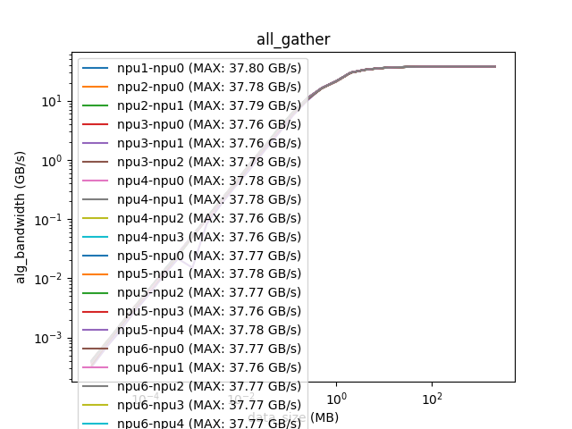 | 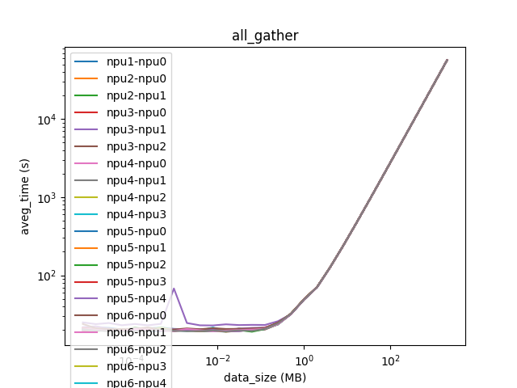 |
|   all_reduce   |  | 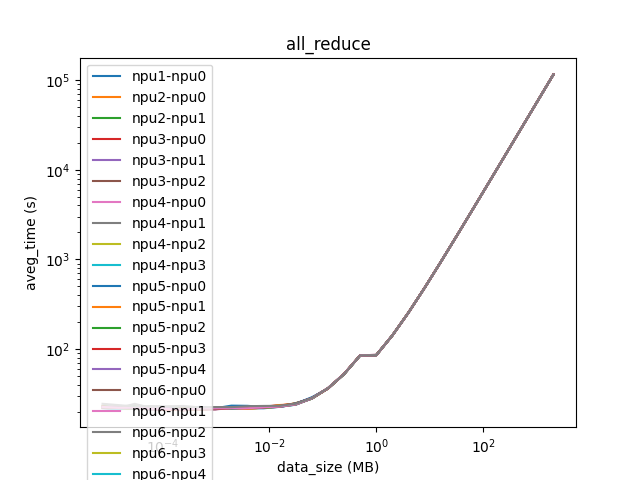 |
|    alltoall    | 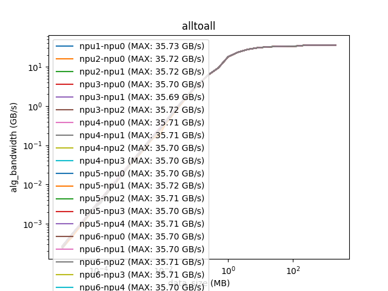 | 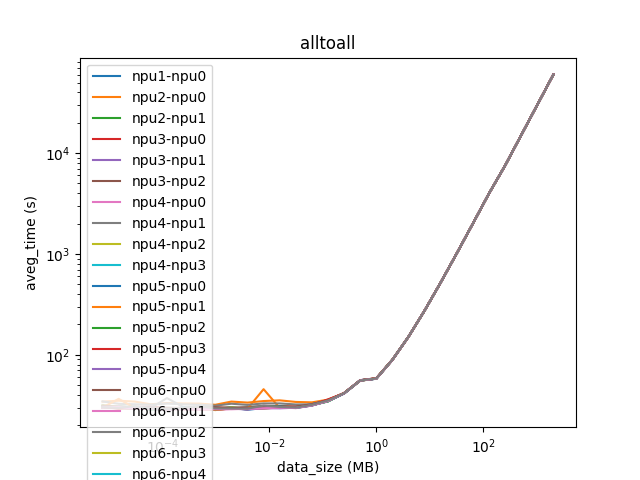 |
|   alltoallv    | 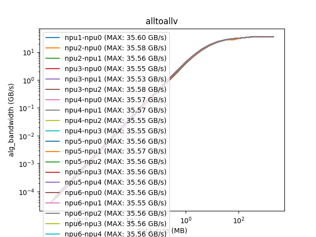 | 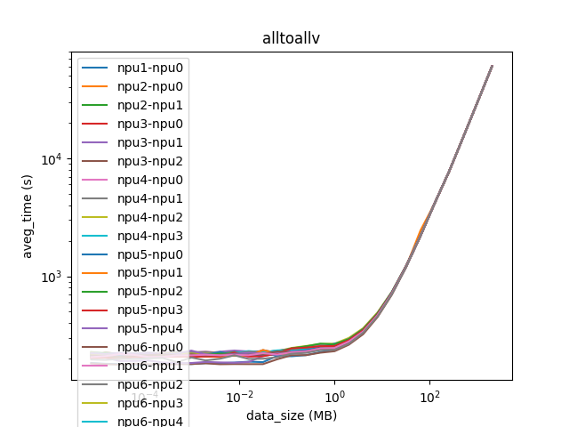 |
|   broadcast    | 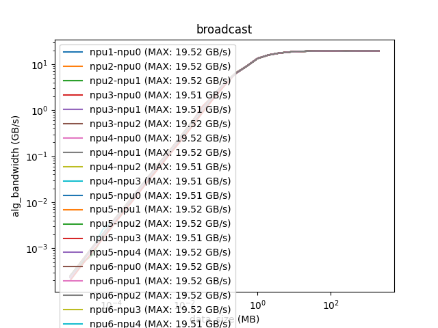 | 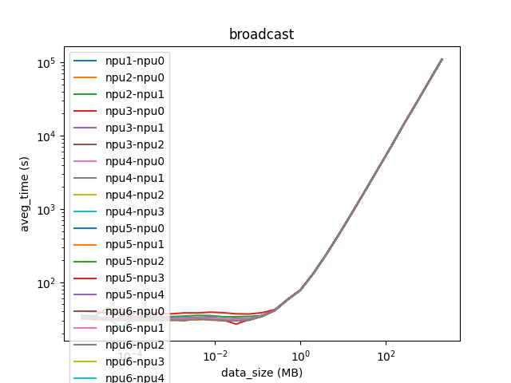 |
|     reduce     | 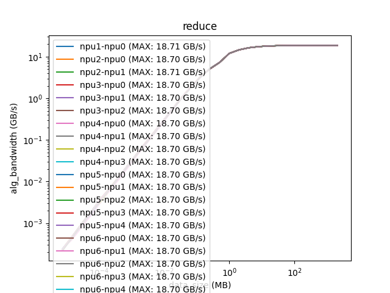 | 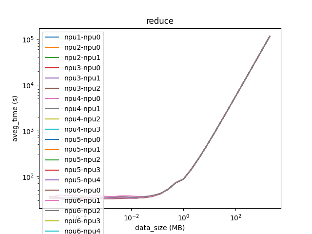 |
| reduce_scatter | 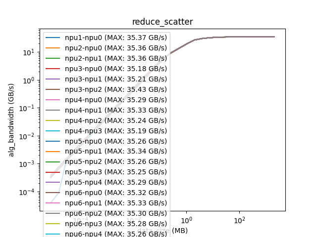 | 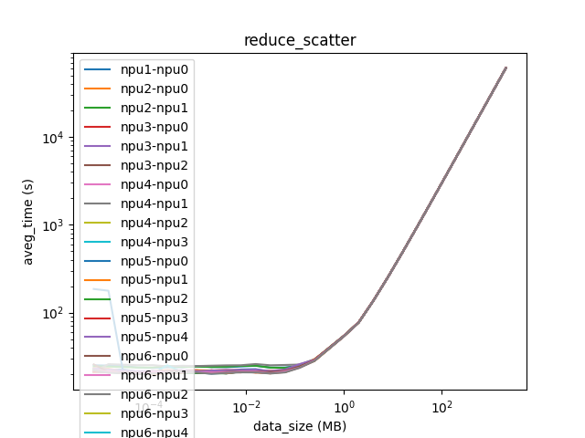 |

- NPU卡对卡之间的连接带宽相对是稳定的、差异性较小
- 在不同的算法下带宽数据表现一致性较好

### 3.1.2 点对点算法带宽

算法带宽是指申请内存空间大小为$N$，算法开始为$M$，则算法带宽为$N/M$，后续的实验证明，不同算法下，主要耗时花费在通信上，因此该带宽数据即为通信带宽数据。

|                        alg_bandwidth                         |                          aveg_time                           |
| :----------------------------------------------------------: | :----------------------------------------------------------: |
| 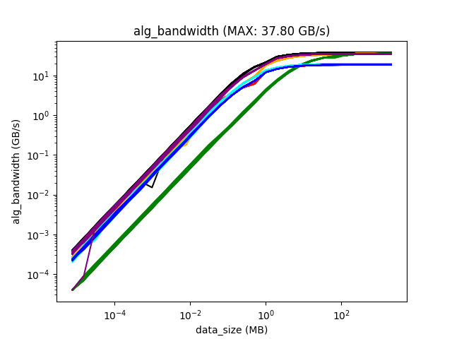 | 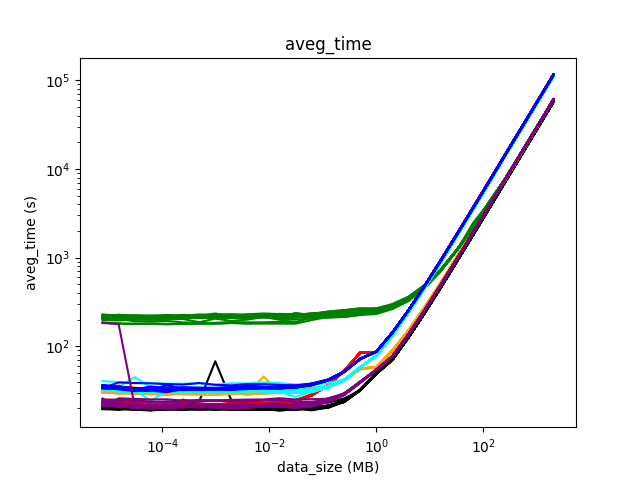 |

- 随着数据包增大，带宽数据逐渐增加，最终稳定在37.8GB/s
- 不同算法对数据包的大小敏感程度不一样，alltoallv（绿色）算法耗时较长

## 3.2 Trace Timeline分析

本章节后续的分析基于**Broadcast**测试案例，数据包大小设置为**2GB**，数据类型为**float**（4字节），HCCL通信Buffer大小为**2G**，**4**张NPU卡作为测试条件

Trace源文件参考：[broadcast_2.0GB.zip](./data/broadcast_2.0GB.zip)

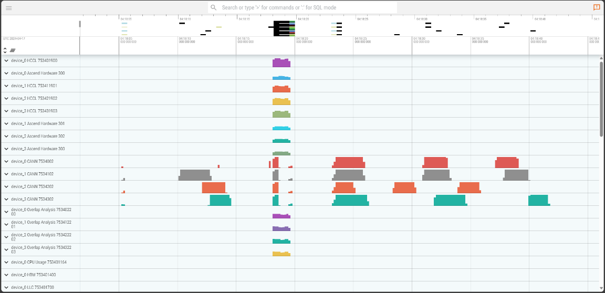

### Stage 1 - 1.692ms

由于设置的数据包大小为2GB，则需要申请2GB空间的集合通信内存（Device侧内存），不同的算法根据其算法的特点，申请的内存大小有所不同

**备注**：数据类型是float，因此实际申请的是0.5GB个float数据所占用的空间，后续均以字节数表示

```bash
main()
 |- hccl_test->opbase_test_by_data_size()
     |- $ hccl_test->hccl_op_base_test()
         |- $ aclrtMalloc()
```

### Stage 2 - 8.097s

申请同样大小（2GB）的Host侧内存（64.476ms）并进行初始化（8.033s）

```bash
main()
 |- hccl_test->opbase_test_by_data_size()
     |- hccl_test->hccl_op_base_test()
         |- $ aclrtMallocHost()
         |- $ hccl_host_buf_init()
```

### Stage 3 - 85.87ms

Host侧的内存进行memcpy操作到Device侧

```bash
main()
 |- hccl_test->opbase_test_by_data_size()
     |- hccl_test->hccl_op_base_test()
         |- $ aclrtMemcpy()
```

### Stage 4 - 4.286s

Host侧申请2G的校验内存空间（65.484ms），用于校验内存数据，并初始化校验内存空间（4.221s）

```bash
main()
 |- hccl_test->opbase_test_by_data_size()
     |- hccl_test->hccl_op_base_test()
         |- $ init_buf_val()
             |- $ aclrtMallocHost()
             |- $ hccl_host_buf_init()
```

### Stage 5 - 1750.615ms

开始集合通信，相关的细节在下一个章节进行分析

```bash
main()
 |- hccl_test->opbase_test_by_data_size()
     |- hccl_test->hccl_op_base_test()
         |- $ HcclBroadcast()
```

### Stage 6 - 170.652ms

申请Host侧的2GB校验空间（64.736ms），并将其Device侧的通信结果复制到该空间中（105.916ms）

```bash
main()
 |- hccl_test->opbase_test_by_data_size()
     |- hccl_test->hccl_op_base_test()
         |- $ check_buf_result()
             |- $ aclrtMallocHost()
             |- $ aclrtMemcpy()
```

### Stage 7 - 3.535s

验证HCCL的通信结果，计算并打印HCCL的测试结果

```bash
main()
 |- hccl_test->opbase_test_by_data_size()
     |- hccl_test->hccl_op_base_test()
         |- check_buf_result()
             |- $ check_buf_result_float()
         |- $ cal_execution_time()
```

### Stage 8 - 115.893ms

释放Device侧的2GB大小的Buffer

```bash
main()
 |- hccl_test->opbase_test_by_data_size()
     |- hccl_test->hccl_op_base_test()
         |- $ aclrtFree()
```

### Stage 9 - 19.554s

释放用于校验的Buffer，一共三块，每块大小2GB

- **host_buf** 是Stage 2申请的Host侧内存，用于初始化Device侧内存数据
- **check_buf** 是Stage 4申请的Host侧内存，储存用于校验的原始数据
- **recv_buff_temp** 是Stage 7申请的Host侧内存，储存来自Device侧的数据

```bash
main()
 |- hccl_test->opbase_test_by_data_size()
     |- hccl_test->hccl_op_base_test()
         |- $ destory_check_buf()
             |- $ aclrtFreeHost()
```

### Timeline

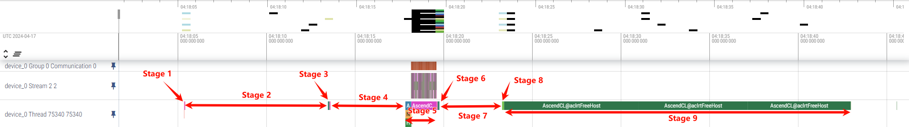

## 3.3 不同集合通信Buffer

上述的测试均基于BufferSize足够大的情况下（所有数据包均可一次发送或接收完成），当HCCL的Buffer不够大时，传输2048MB的数据进行切片分割

以Broadcast算法为例，分别设置HCCL Buffer大小为2048MB和10MB进行测试，HCCL通信一次对应的Trace结果如下图所示

源文件参考路径：[broadcast_buffer2048M.zip](./data/hccl_buffer/broadcast_buffer2048M.zip)和[broadcast_buffer10M.zip](./data/hccl_buffer/broadcast_buffer10M.zip)

### 3.3.1 2048MB

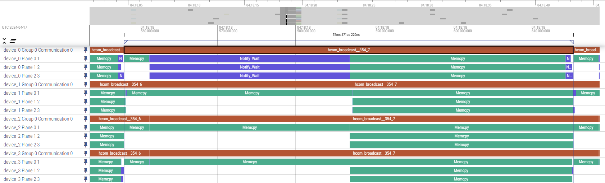

### 3.3.2 10MB

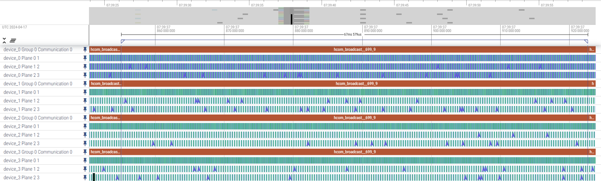

## 3.4 不同集合通信算法

在Trace中，通信带宽数据有两处可以查阅到，一是查看`HBM`数据，该数据按照一定的时间间隔进行采集，整体的颗粒度不够高，但是可以从全局查看整体变化趋势；二是在`HCCL`的`memcpy`阶段存在`size`字段，可以查看到每个阶段具体的`memcpy`内存数量

在`HCCL`的`memcpy`字段下不仅存在`size`字段，还存在`link type`、`bandwidth`、`transport type`、`src rank`、`dst rank`等字段，可以用于后续分析

以数据包大小设置为**2GB**，数据类型为**float**（4字节），HCCL通信Buffer大小为**2G**，**8**张NPU卡作为测试条件，相关的原始文件参考[trace_log/](./data/trace_log/)

需要注意的是本文拿到的所有地址均为虚拟地址，每个rank拿到的虚拟地址可能是相同的（由内存管理模块分配）但对应的物理地址是不同的，因此地址信息不能作为是否Buffer复用的判定依据

> 本人能力有限，对每个集合通信算法中每次进行memcpy等任务无法进行分析，如果有大佬了解每一步的具体操作，还望不吝赐教~

### 3.4.1 all_gather

#### A. Host侧内存

|        rank_id         |    type    |    host_ptr    | host_size |                            value                             |
| :--------------------: | :--------: | :------------: | :-------: | :----------------------------------------------------------: |
| 0, 1, 2, 3, 4, 5, 6, 7 | init_buff  | 0x124080c00000 |   256MB   |                    1, 2, 3, 4, 5, 6, 7, 8                    |
| 0, 1, 2, 3, 4, 5, 6, 7 | check_buff | 0x124a80000000 |    2GB    | [1, 2, 3, 4, 5, 6, 7, 8]<br>[1, 2, 3, 4, 5, 6, 7, 8]<br>... ... |

#### B. Device侧内存

|        rank_id         | type |      ptr       | malloc | trans_count |
| :--------------------: | :--: | :------------: | :----: | :---------: |
| 0, 1, 2, 3, 4, 5, 6, 7 | send | 0x124041200000 | 256MB  | 64M (256MB) |
| 0, 1, 2, 3, 4, 5, 6, 7 | recv | 0x1242c0000000 |  2GB   | 64M (256MB) |

#### C. Trace分析

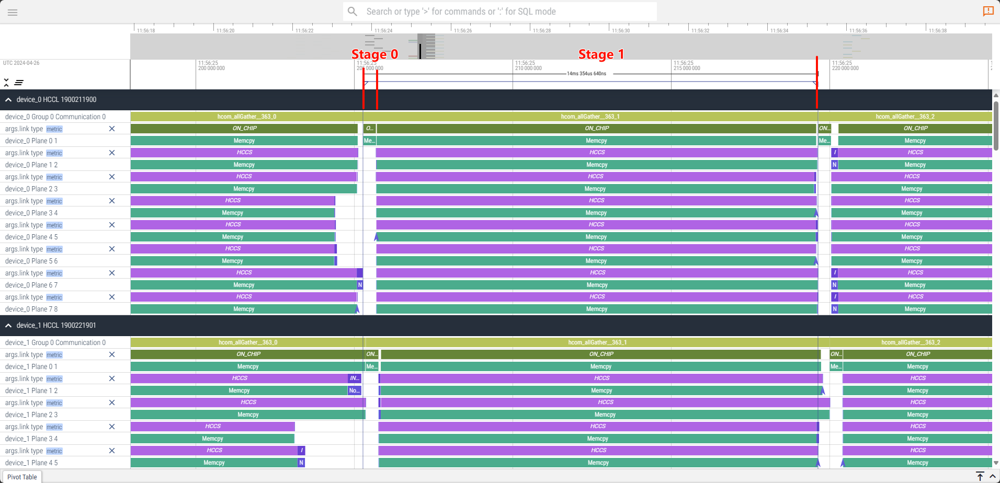

| stage | src  |       dst       |     type     | size  | remark                           |
| :---: | :--: | :-------------: | :----------: | :---: | :------------------------------- |
|   0   |  0   |        0        |     CHIP     | 256MB | 把rank_0的数据放在发送缓冲区     |
|   1   |  0   | 0<br>others (7) | CHIP<br>HCCS | 256MB | 把rank_0的数据通过发送到目标设备 |

### 3.4.2 all_reduce

#### A. Host侧内存

|        rank_id         |    type    |    host_ptr    | host_size |         value          |
| :--------------------: | :--------: | :------------: | :-------: | :--------------------: |
| 0, 1, 2, 3, 4, 5, 6, 7 | init_buff  | 0x124440000000 |    2GB    | 1, 2, 3, 4, 5, 6, 7, 8 |
| 0, 1, 2, 3, 4, 5, 6, 7 | check_buff | 0x124bc0000000 |    2GB    |           36           |

#### B. Device侧内存

|        rank_id         | type |      ptr       | malloc | trans_count |
| :--------------------: | :--: | :------------: | :----: | :---------: |
| 0, 1, 2, 3, 4, 5, 6, 7 | send | 0x1242c0000000 |  2GB   | 512M (2GB)  |
| 0, 1, 2, 3, 4, 5, 6, 7 | recv | 0x124380000000 |  2GB   | 512M (2GB)  |

#### C. Trace分析

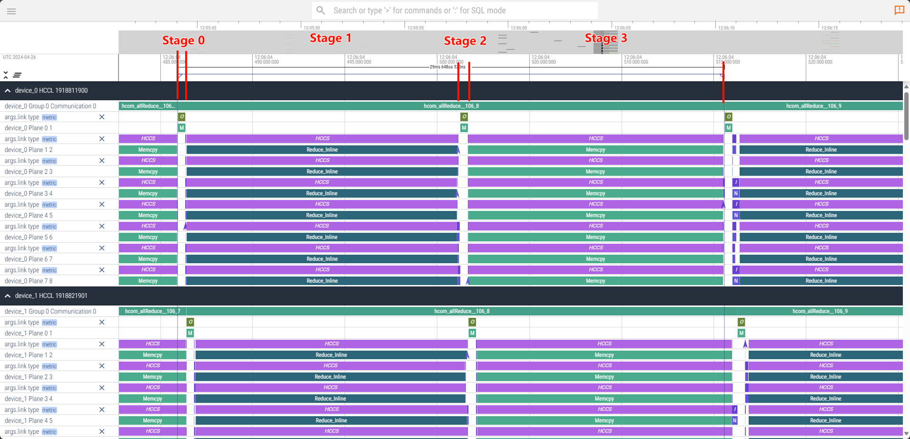

| stage | src  |    dst     |        type        | size  | remark                         |
| :---: | :--: | :--------: | :----------------: | :---: | :----------------------------- |
|   0   |  0   |     0      |        CHIP        | 256MB | 把rank_0的数据放在发送缓冲区   |
|   1   |  0   | others (7) | HCCS (Reduce_FP32) | 256MB | 对其他的几个rank进行reduce操作 |
|   2   |  0   |     0      |        CHIP        | 256MB |                                |
|   3   |  0   | others (7) |        HCCS        | 256MB |                                |

### 3.4.3 alltoall

#### A. Host侧内存

|        rank_id         |    type    |    host_ptr    | host_size |                            value                             |
| :--------------------: | :--------: | :------------: | :-------: | :----------------------------------------------------------: |
| 0, 1, 2, 3, 4, 5, 6, 7 | init_buff  | 0x124440000000 |    2GB    |                    1, 2, 3, 4, 5, 6, 7, 8                    |
| 0, 1, 2, 3, 4, 5, 6, 7 | check_buff | 0x124c40000000 |    2GB    | [1, 2, 3, 4, 5, 6, 7, 8]<br/>[1, 2, 3, 4, 5, 6, 7, 8]<br/>... ... |

#### B. Device侧内存

|        rank_id         | type |      ptr       | malloc | trans_count |
| :--------------------: | :--: | :------------: | :----: | :---------: |
| 0, 1, 2, 3, 4, 5, 6, 7 | send | 0x1242c0000000 |  2GB   | 64M (256MB) |
| 0, 1, 2, 3, 4, 5, 6, 7 | recv | 0x124380000000 |  2GB   | 64M (256MB) |

#### C. Trace分析

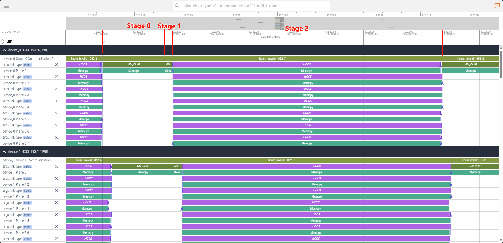

| stage | src  |    dst     | type | size  | remark |
| :---: | :--: | :--------: | :--: | :---: | :----- |
|   0   |  0   |     0      | CHIP |  2GB  |        |
|   1   |  0   |     0      | CHIP | 256MB |        |
|   2   |  0   | others (7) | HCCS | 256MB |        |

### 3.4.4 alltoallv

#### A. Host侧内存

|        rank_id         |    type    |    host_ptr    | host_size |                            value                             |
| :--------------------: | :--------: | :------------: | :-------: | :----------------------------------------------------------: |
| 0, 1, 2, 3, 4, 5, 6, 7 | init_buff  | 0x124440000000 |    2GB    |                    1, 2, 3, 4, 5, 6, 7, 8                    |
| 0, 1, 2, 3, 4, 5, 6, 7 | check_buff | 0x124c40000000 |    2GB    | [1, 2, 3, 4, 5, 6, 7, 8]<br/>[1, 2, 3, 4, 5, 6, 7, 8]<br/>... ... |

#### B. Device侧内存

|        rank_id         | type |      ptr       | malloc | trans_count |
| :--------------------: | :--: | :------------: | :----: | :---------: |
| 0, 1, 2, 3, 4, 5, 6, 7 | send | 0x1242c0000000 |  2GB   | 64M (256MB) |
| 0, 1, 2, 3, 4, 5, 6, 7 | recv | 0x124380000000 |  2GB   | 64M (256MB) |

#### C. Trace分析


| stage | src  |    dst     | type | size  | remark |
| :---: | :--: | :--------: | :--: | :---: | :----- |
|   0   |  0   |     ?      |  ?   |   ?   |        |
|   1   |  0   |     0      | CHIP |  2GB  |        |
|   2   |  0   |     0      | CHIP | 256MB |        |
|   3   |  0   | others (7) | HCCS | 256MB |        |

### 3.4.5 broadcast

#### A. Host侧内存

|        rank_id         |    type    |    host_ptr    | host_size | value |
| :--------------------: | :--------: | :------------: | :-------: | :---: |
|           0            | init_buff  | 0x124380000000 |    2GB    |   1   |
| 0, 1, 2, 3, 4, 5, 6, 7 | check_buff | 0x124780000000 |    2GB    |   1   |

#### B. Device侧内存

|        rank_id         | type |      ptr       | malloc | trans_count |
| :--------------------: | :--: | :------------: | :----: | :---------: |
|           0            | send | 0x1242c0000000 |  2GB   | 512M (2GB)  |
|           0            | recv | 0x1242c0000000 |  2GB   | 512M (2GB)  |
| 0, 1, 2, 3, 4, 5, 6, 7 | send | 0x1242c0000000 |  2GB   | 512M (2GB)  |
| 0, 1, 2, 3, 4, 5, 6, 7 | recv | 0x1242c0000000 |  2GB   | 512M (2GB)  |

#### C. Trace分析

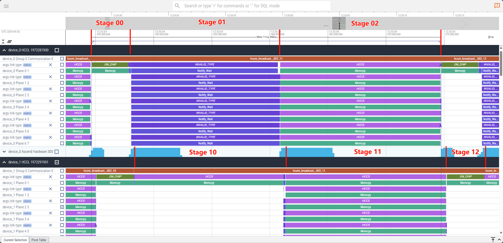

| stage | src  |    dst     |    type     | size  | remark |
| :---: | :--: | :--------: | :---------: | :---: | :----- |
|  00   |  0   |     0      |    CHIP     |  2GB  |        |
|  01   |  0   | others (7) | NOTIFY_WAIT |  NA   |        |
|  02   |  0   | others (7) |    HCCS     | 256MB |        |
|  10   | 1-7  |     0      |    HCCS     | 256MB |        |
|  11   | 1-7  | others (7) |    HCCS     | 256MB |        |
|  12   | 1-7  |    1-7     |    CHIP     |  2G   |        |

### 3.4.6 reduce

#### A. Host侧内存

|        rank_id         |    type    |    host_ptr    | host_size |         value          |
| :--------------------: | :--------: | :------------: | :-------: | :--------------------: |
| 0, 1, 2, 3, 4, 5, 6, 7 | init_buff  | 0x124440000000 |    2GB    | 1, 2, 3, 4, 5, 6, 7, 8 |
|           0            | check_buff | 0x124bc0000000 |    2GB    |           36           |
|  1, 2, 3, 4, 5, 6, 7   | check_buff | 0x124bc0000000 |    2GB    |           0            |

#### B. Device侧内存

|        rank_id         | type |      ptr       | malloc | trans_count |
| :--------------------: | :--: | :------------: | :----: | :---------: |
| 0, 1, 2, 3, 4, 5, 6, 7 | send | 0x1242c0000000 |  2GB   | 512M (2GB)  |
| 0, 1, 2, 3, 4, 5, 6, 7 | recv | 0x124380000000 |  2GB   | 512M (2GB)  |

#### C. Trace分析

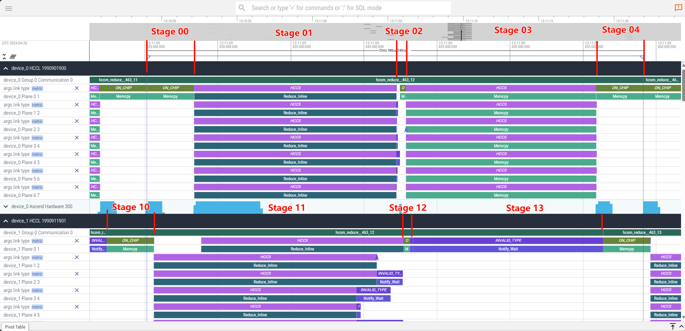

| stage | src  |    dst     |        type        | size  | remark |
| :---: | :--: | :--------: | :----------------: | :---: | :----- |
|  00   |  0   |     0      |        CHIP        |  2GB  |        |
|  01   |  0   | others (7) | HCCS (Reduce_FP32) | 256MB |        |
|  02   |  0   |     0      |        CHIP        | 256MB |        |
|  03   |  0   | others (7) |        HCCS        | 256MB |        |
|  04   |  0   |     0      |        CHIP        |  2GB  |        |
|  10   | 1-7  |    1-7     |        CHIP        |  2GB  |        |
|  11   | 1-7  | others (7) | HCCS (Reduce_FP32) | 256MB |        |
|  12   | 1-7  |    1-7     |        CHIP        | 256MB |        |
|  13   | 1-7  |     0      |    NOTIFY_WAIT     |  NA   |        |

### 3.4.7 reduce_scatter

#### A. Host侧内存

|        rank_id         |    type    |    host_ptr    | host_size |                            value                             |
| :--------------------: | :--------: | :------------: | :-------: | :----------------------------------------------------------: |
| 0, 1, 2, 3, 4, 5, 6, 7 | init_buff  | 0x124380000000 |    2GB    | [10, 11, 12, 13, 14, 15, 16, 17]<br>[10, 11, 12, 13, 14, 15, 16, 17]<br>... ... |
| 0, 1, 2, 3, 4, 5, 6, 7 | check_buff | 0x124080c00000 |   256MB   |             80<br>88 (+8)<br>96 (+8)<br>... ...              |

#### B. Device侧内存

|        rank_id         | type |      ptr       | malloc | trans_count |
| :--------------------: | :--: | :------------: | :----: | :---------: |
| 0, 1, 2, 3, 4, 5, 6, 7 | send | 0x1242c0000000 |  2GB   | 64M (256MB) |
| 0, 1, 2, 3, 4, 5, 6, 7 | recv | 0x124041200000 | 256MB  | 64M (256MB) |

#### C. Trace分析

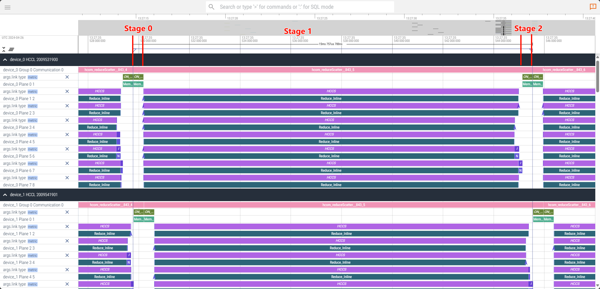

| stage | src  |    dst     |        type        | size  | remark |
| :---: | :--: | :--------: | :----------------: | :---: | :----- |
|   0   |  0   |     0      |        CHIP        | 256MB |        |
|   1   |  0   | others (7) | HCCS (Reduce_FP32) | 256MB |        |
|   2   |  0   |     0      |        CHIP        | 256MB |        |

