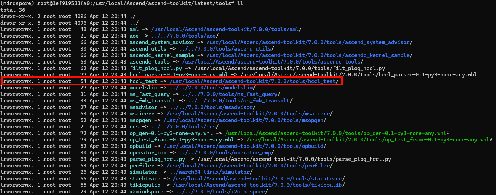
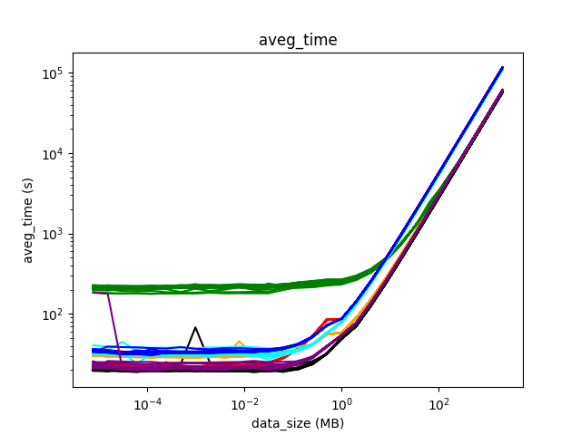

# HCCL集合通信测试

## 1. 快速使用

HCCL（Huawei Collective Communication Library）是基于昇腾AI处理器的高性能集合通信库，其主要功能与作用与Nvidia的NCCL库相似，主要用于集合通信，CANN库种自带一套测试工具用以分析集合通信性能。

### 1.1 编译环境配置

前置环境配置阶段请参考[Llama2部署记录](https://git.zzudongxiang.com/pcl.cloudbrain.project/mindspore.llama2/src/branch/main/README.md)，后续的所有流程均需要在具备HCCL硬件的平台上实现，需要注意的是，建议使用的Ubuntu版本大于等于20.04LTS，否则可能会遇到VSCode不支持的情况。

#### A. CANN

CANN的配置过程参考[Llama2部署记录](https://git.zzudongxiang.com/pcl.cloudbrain.project/mindspore.llama2/src/branch/main/README.md)文档的**4. 安装CANN**章节，并记录安装位置，以备后续使用

完成CANN后，建议在`~/.bashrc`文件中添加对应的环境变量，例如：

```bash
# 使用nano打开~/.bashrc文件
nano ~/.bashrc
```

在文件的最后添加`export ASCEND_HOME=/usr/local/Ascend/ascend-toolkit/latest`

#### B. OpenMPI

在[OpenMPI官网](https://www.mpich.org/)找到对应版本的安装包下载，然后解压缩安装包，以`mpich-4.2.0`版本为例：

```bash
# mpich下载链接参考：https://www.mpich.org/static/downloads
wget https://www.mpich.org/static/downloads/4.2.0/mpich-4.2.0.tar.gz
# 解压缩mpich压缩包
tar -zxvf mpich-4.2.0.tar.gz
```

配置mpi的安装路径，以`/root/mpich`路径为例：

```bash
# 新建文件夹
mkdir ~/mpich
# 进入解压缩后的mpich文件夹
cd mpich-4.2.0
# 配置安装路径
./configure -prefix=/root/mpich --disable-fortran
```

使用`make`命令构建mpich的可执行文件，该过程可能耗时比较长

```bash
make
make install
```

完后后将mpich添加到环境变量种，并添加对应的链接库和帮助文件

```bash
# 修改~/.bashrc文件
nano ~/.bashrc
```

在最后一行添加以下内容：

- `export MPI_HOME=/root/mpich`
- `export PATH=$MPI_HOME/bin:$PATH`
- `export MANPATH=$MPI_HOME/man:$MANPATH`
- `export LD_LIBRARY_PATH=$MPI_HOME/lib:$LD_LIBRARY_PATH`

### 1.2 文件编译

本章节参考链接：[【昇腾】Ascend Snt9B集合通信算子单机多卡性能测试指导](https://bbs.huaweicloud.com/blogs/413870)

为了方便后续修改`hccl_test`内的文件，且保持一份未修改的源文件，建议将对应的文件复制到用户路径下，例如复制到`/root/Workdir`路径下

```bash
cp -r /usr/local/Ascend/ascend-toolkit/7.0.0/tools/hccl_test /root/Workdir/
```

由于配置的`ASCEND_HOME`指向的文件夹是一个链接，在复制`hccl_test`文件夹的时候需要复制源文件而不是文件夹链接，因此可以通过命令查看其对应的真实文件路径

```bash
# 切换到ASCEND_HOME路径
cd $ASCEND_HOME/tools
# 查看链接的真实地址
ll
```



切换到复制后的文件夹后，执行编译命令：

```bash
# 切换到复制后的文件夹中
cd /root/Workdir/hccl_test
# 编译文件
make MPI_HOME=/home/mpich ASCEND_DIR=/usr/local/Ascend/ascend-toolkit/latest
```

编译完成后会在新建的`./bin`文件夹中出现多个*_test可执行文件

### 1.3 运行测试案例

执行以下命令即可进行简单测试：

```bash
# mpirun -n 8 * 表示使用mpi拉起8个进程，建议与最后的-p参数保持一致
mpirun -n 8 ./bin/all_reduce_test -b 8 -e 2048M -f 2 -p 8
```

对应的测试配置参数及其释义如下：

```test
-b,--minbytes <min size in bytes>
-e,--maxbytes <max size in bytes>
-i,--stepbytes <increment size>
-f,--stepfactor <increment factor>
-n,--iters <iteration count>
-o,--op <sum/prod/min/max>
-d,--datatype <int8/int16/int32/fp16/fp32/int64/uint64/uint8/uint16/uint32/fp64/bfp16>
-r,--root <root>
-w,--warmup_iters <warmup iteration count>
-c,--check <result verification> 0:disabled 1:enabled.
-p,--npus <npus used for one node>
-h,--help
```

如果需要修改HCCL通信的缓冲区大小（每次HCCL通信可发送/接收的数据包大小），可以在执行之前设置环境变量`HCCL_BUFFSIZE`，单位MB，例如设置缓冲区大小为2GB：

```bash
export HCCL_BUFFSIZE=2048
```

## 2. 调试环境配置

为了方便调试和分析hccl_test编写的测试工具在运行中各个参数与之对应的实际生效作用关系，需要配置调试环境进行单步调试，通过抓取运行中的寄存器值可以看到每个参数实际对应的功能。

### 2.1 VSCode设置

VSCode需要安装`Remote-SSH`插件连接到远程服务器，插件安装过程参考其他教程，在使用`Remote-SSH`插件连接到远程服务器后需要在远程服务器上安装`C/C++`、`Jupyter`、`Python`等扩展

使用`Remote-SSH`登录到服务器上的指定文件夹，并新建`.vscode`文件夹，并在该文件夹下新建以下三个配置文件`c_cpp_properties.json`、`launch.json`、`tasks.json`

#### A. c_cpp_properties.json

该文件主要用于配置在编辑器中是否显示静态检查结果，例如部分头文件无法找到会出现红色波浪等

```json
{
    "env":{
        "ASCEND_HOME": "/usr/local/Ascend/ascend-toolkit/latest"
    },
    "configurations": [
        {
            "name": "linux-gcc-arm64",
            "includePath": [
                "${workspaceFolder}",
                "${workspaceFolder}/common/src",
                "${workspaceFolder}/common/utils",
                "${workspaceFolder}/opbase_test",
                "${MPI_HOME}/include",
                "${ASCEND_HOME}/include"
            ],
            "defines": [
                "MEM_DUMP"
            ],
            "compilerPath": "/usr/bin/gcc",
            "cStandard": "c11",
            "cppStandard": "gnu++11",
            "intelliSenseMode": "linux-gcc-arm64",
            "mergeConfigurations": false
        }
    ],
    "version": 4
}
```

- **includePath**：将代码所需的头文件路径添加到该字段下即可

#### B. launch.json

该文件主要用于配置调试器，在调试C/C++工具时需要先安装gdb工具，安装命令：`apt install gdb`

```json
{
  "configurations": [
    {
      "name": "C/C++: gcc 生成和调试活动文件",
      "type": "cppdbg",
      "request": "launch",
      "program": "${workspaceFolder}/bin/zhangdx_test",
      "args": [],
      "stopAtEntry": false,
      "cwd": "${workspaceFolder}",
      "environment": [],
      "externalConsole": false,
      "MIMode": "gdb",
      "setupCommands": [
        {
          "description": "为 gdb 启用整齐打印",
          "text": "-enable-pretty-printing",
          "ignoreFailures": true
        },
        {
          "description": "将反汇编风格设置为 Intel",
          "text": "-gdb-set disassembly-flavor intel",
          "ignoreFailures": true
        }
      ],
      "preLaunchTask": "C/C++: gcc 生成活动文件",
      "miDebuggerPath": "/usr/bin/gdb",
      "envFile": "${workspaceFolder}/.env"
    }
  ],
  "version": "2.0.0"
}
```

- **program**：编译后生成的可执行文件，编译参数见`tasks.json`文件
- **envFile**：程序运行时添加的环境变量，可参考`.env`文件
- **preLaunchTask**：编译可执行文件的参数配置，参考`tasks.json`文件

#### C. tasks.json

该文件主要用于编译生成可执行文件，相关的编译参数需要添加到该文件中，参数信息参考`Makefile`文件

```json
{
    "tasks": [
        {
            "type": "cppbuild",
            "label": "C/C++: gcc 生成活动文件",
            "command": "/usr/bin/gcc",
            "args": [
                "-Wl,--copy-dt-needed-entries",
                "-fdiagnostics-color=always",
                "${workspaceFolder}/common/utils/**.cc",
                "${workspaceFolder}/common/src/**.cc",
                "-g",
                "${workspaceFolder}/opbase_test/zhangdx_test.cc",
                "-o",
                "${workspaceFolder}/bin/zhangdx_test",
                "-I${workspaceFolder}/common/src",
                "-I${workspaceFolder}/common/utils",
                "-I${workspaceFolder}/opbase_test",
                "-I${MPI_HOME}/include",
                "-I${ASCEND_HOME}/include",
                "-L${MPI_HOME}/lib",
                "-L${ASCEND_HOME}/lib64",
                "-lhccl",
                "-lascendcl",
                "-lmpi",
                "-DMEM_DUMP"
            ],
            "options": {
                "cwd": "${fileDirname}"
            },
            "problemMatcher": [
                "$gcc"
            ],
            "group": "build",
            "detail": "调试器生成的任务"
        }
    ],
    "version": "2.0.0"
}
```

- **label**：与`launch.json`文件中的`preLaunchTask`字段对应

- **args**：编译参数，具体参考`Makefile`文件

### 2.2 msprof设置

本章节参考：[采集昇腾AI处理器系统数据](https://www.hiascend.com/document/detail/zh/CANNCommunityEdition/80RC1alpha003/devaids/auxiliarydevtool/atlasprofiling_16_0012.html)，可以根据文档内容直接运行对应的执行参数，但是为了方便程序运行与调试，请参考[8卡Trace采集脚本](./script/run_8npu.ipynb)

运行脚本后会在`./log/prof/*.json`路径中出现对应的timeline文件，打开[Perfetto](https://ui.perfetto.dev/)网站，导入对应的json文件即可查看和分析对应的测试Trace


### 2.3 点对点数据抓取

点对点NPU测试（数据交换）测试速度比**msprof**抓取Trace快，可以测试不同数据包下的性能表现，测试脚本参考[点对点测试脚本](./script/run_2npu.ipynb)

|                          aveg_time                           |                         alg_bandwidt                         |
| :----------------------------------------------------------: | :----------------------------------------------------------: |
|  |  |

## 3. 多机通信测试

> 本章节未进行验证，相关内容参考CANN库中自带的教程

- 多机集群训练时，需配置环境变量指定host网卡：（HCCL_SOCKET_IFNAME）

```bash
# 配置HCCL的初始化root通信网卡名，HCCL可通过该网卡名获取Host IP，完成通信域创建。
# 支持以下格式配置：(4种规格自行选择1种即可)
# export HCCL_SOCKET_IFNAME=eth,enp ：使用所有以eth或enp前缀的网卡，比如eth1,eth2,enp1…
# export HCCL_SOCKET_IFNAME==eth,enp ：使用eth或enp的网卡
# export HCCL_SOCKET_IFNAME=^eth,enp ：不要使用任何以eth或enp前缀的网卡
# export HCCL_SOCKET_IFNAME=^=eth,enp ：不要使用eth或enp网卡

注：网卡名仅为举例说明，并不只对eth,enp网卡生效
```

- 多机集群训练时，需统计所有节点使用的host网卡信息：

```bash
# 编辑全部参与训练的节点ip:每节点的进程数
nano hostfile
# 10.78.130.22:8
# 10.78.130.21:8
# ...
```

- 多节点运行：（两节点为例）

```bash
mpirun -f hostfile -n 16 ./bin/all_reduce_test -b 8K -e 64M -f 2 -d fp32 -o sum -p 8
```
