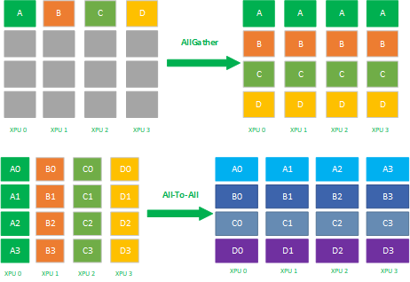

# 1. 快速使用

HCCL（Huawei Collective Communication Library）是基于昇腾AI处理器的高性能集合通信库，其主要功能与作用与Nvidia的NCCL库相似，主要用于集合通信，CANN库种自带一套测试工具用以分析集合通信性能。

## 1.1 编译环境配置

前置环境配置阶段请参考[Ascend上创建Docker](https://gitee.com/zzudongxiang/ascend.docker)，后续的所有流程均需要在具备HCCL硬件的平台上实现，需要注意的是，建议使用的Ubuntu版本大于等于20.04LTS，否则可能会遇到VSCode不支持的情况。

### 1.1.1 CANN

CANN的配置过程参考[Ascend上创建Docker](https://gitee.com/zzudongxiang/ascend.docker)文档的**安装CANN**章节，并记录安装位置，以备后续使用

完成CANN后，建议在`~/.bashrc`文件中添加对应的环境变量，例如：

```bash
# 使用nano打开~/.bashrc文件
nano ~/.bashrc
```

在文件的最后添加`export ASCEND_HOME=/usr/local/Ascend/ascend-toolkit/latest`

### 1.1.2 OpenMPI

在[OpenMPI官网](https://www.mpich.org/)找到对应版本的安装包下载，然后解压缩安装包，以`mpich-4.2.0`版本为例：

```bash
# mpich下载链接参考：https://www.mpich.org/static/downloads
wget https://www.mpich.org/static/downloads/4.2.0/mpich-4.2.0.tar.gz
# 解压缩mpich压缩包
tar -zxvf mpich-4.2.0.tar.gz
```

配置mpi的安装路径，以`/root/mpich`路径为例：

```bash
# 新建文件夹
mkdir ~/mpich
# 进入解压缩后的mpich文件夹
cd mpich-4.2.0
# 配置安装路径
./configure -prefix=/root/mpich --disable-fortran
```

使用`make`命令构建mpich的可执行文件，该过程可能耗时比较长

```bash
make
make install
```

完后后将mpich添加到环境变量种，并添加对应的链接库和帮助文件

```bash
# 修改~/.bashrc文件
nano ~/.bashrc
```

在最后一行添加以下内容：

- `export MPI_HOME=/root/mpich`
- `export PATH=$MPI_HOME/bin:$PATH`
- `export MANPATH=$MPI_HOME/man:$MANPATH`
- `export LD_LIBRARY_PATH=$MPI_HOME/lib:$LD_LIBRARY_PATH`

## 1.2 文件编译

本章节参考链接：[【昇腾】Ascend Snt9B集合通信算子单机多卡性能测试指导](https://bbs.huaweicloud.com/blogs/413870)

为了方便后续修改`hccl_test`内的文件，且保持一份未修改的源文件，建议将对应的文件复制到用户路径下，例如复制到`/root/Workdir`路径下

```bash
cp -r /usr/local/Ascend/ascend-toolkit/7.0.0/tools/hccl_test /root/Workdir/
```

由于配置的`ASCEND_HOME`指向的文件夹是一个链接，在复制`hccl_test`文件夹的时候需要复制源文件而不是文件夹链接，因此可以通过命令查看其对应的真实文件路径

```bash
# 切换到ASCEND_HOME路径
cd $ASCEND_HOME/tools
# 查看链接的真实地址
ll
```


切换到复制后的文件夹后，执行编译命令：

```bash
# 切换到复制后的文件夹中
cd /root/Workdir/hccl_test
# 编译文件
make MPI_HOME=/home/mpich ASCEND_DIR=/usr/local/Ascend/ascend-toolkit/latest
```

编译完成后会在新建的`./bin`文件夹中出现多个*_test可执行文件

## 1.3 运行测试案例

执行以下命令即可进行简单测试：

```bash
# mpirun -n 8 * 表示使用mpi拉起8个进程，建议与最后的-p参数保持一致
mpirun -n 8 ./bin/all_reduce_test -b 8 -e 2048M -f 2 -p 8
```

对应的测试配置参数及其释义如下：

```test
-b,--minbytes <min size in bytes>
-e,--maxbytes <max size in bytes>
-i,--stepbytes <increment size>
-f,--stepfactor <increment factor>
-n,--iters <iteration count>
-o,--op <sum/prod/min/max>
-d,--datatype <int8/int16/int32/fp16/fp32/int64/uint64/uint8/uint16/uint32/fp64/bfp16>
-r,--root <root>
-w,--warmup_iters <warmup iteration count>
-c,--check <result verification> 0:disabled 1:enabled.
-p,--npus <npus used for one node>
-h,--help
```

如果需要修改HCCL通信的缓冲区大小（每次HCCL通信可发送/接收的数据包大小），可以在执行之前设置环境变量`HCCL_BUFFSIZE`，单位MB，例如设置缓冲区大小为2GB：

```bash
export HCCL_BUFFSIZE=2048
```

# 2. 调试环境配置

为了方便调试和分析hccl_test编写的测试工具在运行中各个参数与之对应的实际生效作用关系，需要配置调试环境进行单步调试，通过抓取运行中的寄存器值可以看到每个参数实际对应的功能。

## 2.1 VSCode设置

VSCode需要安装`Remote-SSH`插件连接到远程服务器，插件安装过程参考其他教程，在使用`Remote-SSH`插件连接到远程服务器后需要在远程服务器上安装`C/C++`、`Jupyter`、`Python`等扩展

使用`Remote-SSH`登录到服务器上的指定文件夹，并新建`.vscode`文件夹，并在该文件夹下新建以下三个配置文件`c_cpp_properties.json`、`launch.json`、`tasks.json`

### 2.1.1 c_cpp_properties.json

[c_cpp_properties.json 文件](./.vscode/c_cpp_properties.json)主要用于配置在编辑器中是否显示静态检查结果，例如部分头文件无法找到会出现红色波浪等

- **includePath**：将代码所需的头文件路径添加到该字段下即可

### 2.1.2 launch.json

[launch.json 文件](./.vscode/launch.json)主要用于配置调试器，在调试C/C++工具时需要先安装gdb工具，安装命令：`apt install gdb`

- **program**：编译后生成的可执行文件，编译参数见`tasks.json`文件
- **envFile**：程序运行时添加的环境变量，可参考`.env`文件
- **preLaunchTask**：编译可执行文件的参数配置，参考`tasks.json`文件

### 2.1.3 tasks.json

[tasks.json 文件](./.vscode/tasks.json)主要用于编译生成可执行文件，相关的编译参数需要添加到该文件中，参数信息参考`Makefile`文件

- **label**：与`launch.json`文件中的`preLaunchTask`字段对应

- **args**：编译参数，具体参考`Makefile`文件

## 2.2 MPI并行调试

### 1. 运行启动命令

在VSCode中的Debug菜单栏选择`hccl_debug`对待调试的文件进行编译，或者切换到`./hccl/`文件夹下使用`make`命令编译所有可执行文件，然后在新的Terminal切换到当前文件目录执行以下命令，以hccl_p2p_rootinfo_test为例，创建两个进程。

```bash
# 先设置环境变量，使当前控制台的进行等待调试进程attach到进程中
export HCCL_MPI_DEBUG=1
# 启动2个进程，对2个进程进行Attach调试
mpirun -n 2 ./bin/hccl_p2p_rootinfo_test
```

此时界面Terminal的界面将会卡住，等待用户的调试进程Attach

### 2. 调试代码

在`main.cc`的第一行打断点，并选择`hccl_mpi_debug`开始进程Attach，待Attach成功后，修改`hccl_mpi_debug`的值为`false`然后就可以跳出while循环，进行代码调试了。

注意Attach的时候选择的进程为运行的进程，而非mpi进程，本例中可以搜索并选择`hccl_p2p_rootinfo_test`进程进行Attach

## 2.3 msprof设置

本章节参考：[采集昇腾AI处理器系统数据](https://www.hiascend.com/document/detail/zh/CANNCommunityEdition/80RC1alpha003/devaids/auxiliarydevtool/atlasprofiling_16_0012.html)，可以根据文档内容直接运行对应的执行参数，但是为了方便程序运行与调试，请参考[8卡Trace采集脚本](./script/run_8npu.ipynb)

运行脚本后会在`./log/prof/*.json`路径中出现对应的timeline文件，打开[Perfetto](https://ui.perfetto.dev/)网站，导入对应的json文件即可查看和分析对应的测试Trace


点对点NPU测试（数据交换）测试速度比**msprof**抓取Trace快，可以测试不同数据包下的性能表现，测试脚本参考[点对点测试脚本](./script/run_2npu.ipynb)

|                          aveg_time                           |                         alg_bandwidt                         |
| :----------------------------------------------------------: | :----------------------------------------------------------: |
|  |  |

# 3. 点对点通信

点对点通信代码参考[hccl_p2p_rootinfo_test.cc](./hccl/hccl_p2p_rootinfo_test.cc)文件，使用HCCL的API进行数据收发，代码架与原生hccl_test相同，在进行点对点通信时，`rank_id % 2 == 0`的rank为发送者，否则为接收者，因此在进行点对点通信时需要确保参与通信的NPU卡个数为偶数，否则可能会导致通信阻塞。

### 3.1 点对点通信带宽

以`NPU0`与`NPU1`为例点对点测试，每次申请的内存大小为1kB至2GB（实际通信量为该值的一半），每次翻一倍，HCCL的通信Buffer设置为2GB（确保不需要切换缓冲区），多次测试的带宽数据如下图所示：


通信带宽最终稳定在20GB/s左右，与Trace分析结果一致。

### 3.2 Trace分析

以`NPU0`与`NPU1`为例点对点测试，申请的内存大小为2GB，实际通信大小为1GB，HCCL的通信Buffer设置为2GB（确保不需要切换缓冲区）：

所有的Trace文件参考：[p2p_trace.zip](./data/p2p_trace.zip)


##### Stage 10 - Rank_0在本地复制1GB数据到HCCL缓冲区

##### Stage 00&Stage11 - 等待传输1GB数据

##### Stage 01 - Rank_1从本地HCCL缓冲区复制1GB数据到接收区

### 3.3 问题

在代码里面`NPU0`作为发送者发送数据给`NPU1`，但是在Trace中显示的却是`NPU0`在等待，`NPU1`执行了`memcpy`操作，且`memcpy`的src为`1`，`dst`为`0`，且从结果来看代码操作逻辑是正常的。

**内存检查**

`rank_0`把发送区所有数据置为`1`，`rank_1`把所有发送去数据置为`2`，经过p2p通信（`rank_0`发送数据给`rank_1`）后，`rank_1`的接收区数据变为了`1`，说明接收了来自`rank_0`的数据，内存检查结果正常。

# 4. 集合通信测试结果

## 4.1 Trace Timeline分析

本章节后续的分析基于**Broadcast**测试案例，数据包大小设置为**2GB**，数据类型为**float**（4字节），HCCL通信Buffer大小为**2G**，**4**张NPU卡作为测试条件

Trace源文件参考：[broadcast_2.0GB.zip](./data/broadcast_2.0GB.zip)


### Stage 1 - 1.692ms

由于设置的数据包大小为2GB，则需要申请2GB空间的集合通信内存（Device侧内存），不同的算法根据其算法的特点，申请的内存大小有所不同

**备注**：数据类型是float，因此实际申请的是0.5GB个float数据所占用的空间，后续均以字节数表示

```bash
main()
 |- hccl_test->opbase_test_by_data_size()
     |- $ hccl_test->hccl_op_base_test()
         |- $ aclrtMalloc()
```

### Stage 2 - 8.097s

申请同样大小（2GB）的Host侧内存（64.476ms）并进行初始化（8.033s）

```bash
main()
 |- hccl_test->opbase_test_by_data_size()
     |- hccl_test->hccl_op_base_test()
         |- $ aclrtMallocHost()
         |- $ hccl_host_buf_init()
```

### Stage 3 - 85.87ms

Host侧的内存进行memcpy操作到Device侧

```bash
main()
 |- hccl_test->opbase_test_by_data_size()
     |- hccl_test->hccl_op_base_test()
         |- $ aclrtMemcpy()
```

### Stage 4 - 4.286s

Host侧申请2G的校验内存空间（65.484ms），用于校验内存数据，并初始化校验内存空间（4.221s）

```bash
main()
 |- hccl_test->opbase_test_by_data_size()
     |- hccl_test->hccl_op_base_test()
         |- $ init_buf_val()
             |- $ aclrtMallocHost()
             |- $ hccl_host_buf_init()
```

### Stage 5 - 1750.615ms

开始集合通信，相关的细节在下一个章节进行分析

```bash
main()
 |- hccl_test->opbase_test_by_data_size()
     |- hccl_test->hccl_op_base_test()
         |- $ HcclBroadcast()
```

### Stage 6 - 170.652ms

申请Host侧的2GB校验空间（64.736ms），并将其Device侧的通信结果复制到该空间中（105.916ms）

```bash
main()
 |- hccl_test->opbase_test_by_data_size()
     |- hccl_test->hccl_op_base_test()
         |- $ check_buf_result()
             |- $ aclrtMallocHost()
             |- $ aclrtMemcpy()
```

### Stage 7 - 3.535s

验证HCCL的通信结果，计算并打印HCCL的测试结果

```bash
main()
 |- hccl_test->opbase_test_by_data_size()
     |- hccl_test->hccl_op_base_test()
         |- check_buf_result()
             |- $ check_buf_result_float()
         |- $ cal_execution_time()
```

### Stage 8 - 115.893ms

释放Device侧的2GB大小的Buffer

```bash
main()
 |- hccl_test->opbase_test_by_data_size()
     |- hccl_test->hccl_op_base_test()
         |- $ aclrtFree()
```

### Stage 9 - 19.554s

释放用于校验的Buffer，一共三块，每块大小2GB

- **host_buf** 是Stage 2申请的Host侧内存，用于初始化Device侧内存数据
- **check_buf** 是Stage 4申请的Host侧内存，储存用于校验的原始数据
- **recv_buff_temp** 是Stage 7申请的Host侧内存，储存来自Device侧的数据

```bash
main()
 |- hccl_test->opbase_test_by_data_size()
     |- hccl_test->hccl_op_base_test()
         |- $ destory_check_buf()
             |- $ aclrtFreeHost()
```

### Timeline


## 4.2 不同集合通信Buffer

上述的测试均基于BufferSize足够大的情况下（所有数据包均可一次发送或接收完成），当HCCL的Buffer不够大时，传输2048MB的数据进行切片分割

以Broadcast算法为例，分别设置HCCL Buffer大小为2048MB和10MB进行测试，HCCL通信一次对应的Trace结果如下图所示

源文件参考路径：[broadcast_buffer2048M.zip](./data/hccl_buffer/broadcast_buffer2048M.zip)和[broadcast_buffer10M.zip](./data/hccl_buffer/broadcast_buffer10M.zip)

### 4.2.1 2048MB


### 4.2.2 10MB


## 4.3 不同集合通信算法

在Trace中，通信带宽数据有两处可以查阅到，一是查看`HBM`数据，该数据按照一定的时间间隔进行采集，整体的颗粒度不够高，但是可以从全局查看整体变化趋势；二是在`HCCL`的`memcpy`阶段存在`size`字段，可以查看到每个阶段具体的`memcpy`内存数量

在`HCCL`的`memcpy`字段下不仅存在`size`字段，还存在`link type`、`bandwidth`、`transport type`、`src rank`、`dst rank`等字段，可以用于后续分析

以数据包大小设置为**2GB**，数据类型为**float**（4字节），HCCL通信Buffer大小为**2G**，**8**张NPU卡作为测试条件，相关的原始文件参考[trace_log/](./data/trace_log/)

需要注意的是本文拿到的所有地址均为虚拟地址，每个rank拿到的虚拟地址可能是相同的（由内存管理模块分配）但对应的物理地址是不同的，因此地址信息不能作为是否Buffer复用的判定依据


### 4.3.1 all_gather

#### A. 通信原语

AllGather属于多对多的通信原语，具有多个数据发送者，多个数据接收者，可以在集群内把多个节点的数据收集到一个主节点上（Gather），再把这个收集到的数据分发到其他节点上（broadcast），即收集集群内所有的数据到所有的节点上。


<center>All Gather过程</center>

AllGather是数据的多对多的同步全收集，它将多张XPU卡上的数据收集到多张XPU卡上，可以看做Gather + Broadcast的操作组合，它的反向操作对应ReduceScatter，其最应用场景有：

- AllGather可应用于模型并行；

- 模型并行里前向计算里的参数全同步，需要用allgather把模型并行里将切分到不同的XPU上的参数全同步到一张XPU上才能进行前向计算。

#### B. Host侧内存

|        rank_id         |    type    |    host_ptr    | host_size |                            value                             |
| :--------------------: | :--------: | :------------: | :-------: | :----------------------------------------------------------: |
| 0, 1, 2, 3, 4, 5, 6, 7 | init_buff  | 0x124080c00000 |   256MB   |                    1, 2, 3, 4, 5, 6, 7, 8                    |
| 0, 1, 2, 3, 4, 5, 6, 7 | check_buff | 0x124a80000000 |    2GB    | [1, 2, 3, 4, 5, 6, 7, 8]<br>[1, 2, 3, 4, 5, 6, 7, 8]<br>... ... |

#### C. Device侧内存

|        rank_id         | type |      ptr       | malloc | trans_count |
| :--------------------: | :--: | :------------: | :----: | :---------: |
| 0, 1, 2, 3, 4, 5, 6, 7 | send | 0x124041200000 | 256MB  | 64M (256MB) |
| 0, 1, 2, 3, 4, 5, 6, 7 | recv | 0x1242c0000000 |  2GB   | 64M (256MB) |

#### D. Trace分析


##### Stage 0 - 申请256MB的发送缓冲区，并将待发送的数据memcpy到发送缓冲区

| src  | dst  | type | size  |
| :--: | :--: | :--: | :---: |
|  0   |  0   | CHIP | 256MB |

##### Stage 1 - 从别的7个NPU卡上获取对应的数据完成Gather

|    src    |    dst    | type | size  |
| :-------: | :-------: | :--: | :---: |
|     0     |     0     | CHIP | 256MB |
|     0     | other (7) | HCCS | 256MB |
| other (7) |     0     | HCCS | 256MB |

### 4.3.2 all_reduce

#### A. 通信原语

AllReduce属于多对多的通信原语，具有多个数据发送者，多个数据接收者，其在集群内的所有节点上都执行相同的Reduce操作，可以将集群内所有节点的数据**规约运算**得到的结果发送到所有的节点上。AllReduce操作可通过在主节点上执行Reduce + Broadcast或ReduceScatter + AllGather实现，如下图所示：先在主节点上执行reduce得到规约累加和26，再把这个累加和26 broadcast到其他的节点，这样整个集群内，每个节点的数值就都保持一致。


<center>All Reduce过程</center>

AllReduce是数据的多对多的规约运算，它将所有的XPU卡上的数据规约（比如SUM求和）到集群内每张XPU卡上，其应用场景有：

- AllReduce应用于数据并行；

- 数据并行各种通信拓扑结构比如Ring allReduce、Tree allReduce里的 allReduce操作；

#### B. Host侧内存

|        rank_id         |    type    |    host_ptr    | host_size |         value          |
| :--------------------: | :--------: | :------------: | :-------: | :--------------------: |
| 0, 1, 2, 3, 4, 5, 6, 7 | init_buff  | 0x124440000000 |    2GB    | 1, 2, 3, 4, 5, 6, 7, 8 |
| 0, 1, 2, 3, 4, 5, 6, 7 | check_buff | 0x124bc0000000 |    2GB    |           36           |

#### C. Device侧内存

|        rank_id         | type |      ptr       | malloc | trans_count |
| :--------------------: | :--: | :------------: | :----: | :---------: |
| 0, 1, 2, 3, 4, 5, 6, 7 | send | 0x1242c0000000 |  2GB   | 512M (2GB)  |
| 0, 1, 2, 3, 4, 5, 6, 7 | recv | 0x124380000000 |  2GB   | 512M (2GB)  |

#### D. Trace分析


##### Stage 0 - 复制256MB（1/8）的数据到发送缓存区

| src  | dst  | type | size  |
| :--: | :--: | :--: | :---: |
|  0   |  0   | CHIP | 256MB |

##### Stage 1 - 接收其他7个节点的数据，并进行1/8的Reduce计算（只计算1/8部分的Reduce）

| src  |    dst     |        type        | size  |
| :--: | :--------: | :----------------: | :---: |
|  0   | others (7) | HCCS (Reduce_FP32) | 256MB |

##### Stage 2 - 将完成Reduce的区块放置到发送缓冲区

| src  | dst  | type | size  |
| :--: | :--: | :--: | :---: |
|  0   |  0   | CHIP | 256MB |

##### Stage 3 - 从其他NPU上获取另外7/8的Reduce结果

|    src     |    dst    | type | size  |
| :--------: | :-------: | :--: | :---: |
|     0      | others(7) | HCCS | 256MB |
| others (7) |     0     | HCCS | 256MB |

### 4.3.3 alltoall

#### A. 通信原语

All-To-All操作每一个节点的数据会scatter到集群内所有节点上，同时每一个节点也会Gather集群内所有节点的数据。ALLTOALL是对ALLGATHER的扩展，区别是ALLGATHER 操作中，不同节点向某一节点收集到的数据是相同的，而在ALLTOALL中，不同的节点向某一节点收集到的数据是不同的，如下图所示



<center>All to All过程</center>

AllToAll是数据的多对多的转置，它将所有张XPU卡上的数据转置到所有的XPU卡上，其主要应用场景有：

-  AllToAll应用于模型并行；

-  模型并行里的矩阵转置；

-  数据并行到模型并行的矩阵转置；

#### B. Host侧内存

|        rank_id         |    type    |    host_ptr    | host_size |                            value                             |
| :--------------------: | :--------: | :------------: | :-------: | :----------------------------------------------------------: |
| 0, 1, 2, 3, 4, 5, 6, 7 | init_buff  | 0x124440000000 |    2GB    |                    1, 2, 3, 4, 5, 6, 7, 8                    |
| 0, 1, 2, 3, 4, 5, 6, 7 | check_buff | 0x124c40000000 |    2GB    | [1, 2, 3, 4, 5, 6, 7, 8]<br/>[1, 2, 3, 4, 5, 6, 7, 8]<br/>... ... |

#### C. Device侧内存

|        rank_id         | type |      ptr       | malloc | trans_count |
| :--------------------: | :--: | :------------: | :----: | :---------: |
| 0, 1, 2, 3, 4, 5, 6, 7 | send | 0x1242c0000000 |  2GB   | 64M (256MB) |
| 0, 1, 2, 3, 4, 5, 6, 7 | recv | 0x124380000000 |  2GB   | 64M (256MB) |

#### D. Trace分析


##### Stage 0 - 设置与源Buffer同样大小的发送缓冲区，并完整复制一份原始数据

| src  | dst  | type | size |
| :--: | :--: | :--: | :--: |
|  0   |  0   | CHIP | 2GB  |

##### Stage 1 - 在本地复制了256MB数据

> [!NOTE]
>
> 这一步是为什么要进行？

| src  | dst  | type | size  |
| :--: | :--: | :--: | :---: |
|  0   |  0   | CHIP | 256MB |

##### Stage 2 - 接收其他节点的数据

|    src     |    dst     | type | size  |
| :--------: | :--------: | :--: | :---: |
|     0      | others (7) | HCCS | 256MB |
| others (7) |     0      | HCCS | 256MB |

### 4.3.4 broadcast

#### A. 通信原语

Broadcast属于**1对多**的通信原语，一个数据发送者，多个数据接收者，可以在集群内把一个节点自身的数据广播到其他节点上。如下图所示，圈圈表示集群中的训练加速卡节点，相同的颜色的小方块则代表相同的数据。当主节点 0 执行Broadcast时，数据即从主节点0被广播至其他节点。


<center>Broadcast过程</center>

Broadcast是数据的1对多的同步，它将一张XPU卡上的数据同步到其他所有的XPU卡上，其应用场景有：

- 数据并行的参数初始化，确保每张卡上的初始参数是一致的；

- allReduce里的 broadcast + reduce组合里的broadcast操作；

- 分布式训练parameter server 参数服务器结构里的 master节点 broadcast 数据到worker节点，再从worker节点reduce数据回master节点里的broadcast操作；

#### B. Host侧内存

|        rank_id         |    type    |    host_ptr    | host_size | value |
| :--------------------: | :--------: | :------------: | :-------: | :---: |
|           0            | init_buff  | 0x124380000000 |    2GB    |   1   |
| 0, 1, 2, 3, 4, 5, 6, 7 | check_buff | 0x124780000000 |    2GB    |   1   |

#### C. Device侧内存

|        rank_id         | type |      ptr       | malloc | trans_count |
| :--------------------: | :--: | :------------: | :----: | :---------: |
| 0, 1, 2, 3, 4, 5, 6, 7 | send | 0x1242c0000000 |  2GB   | 512M (2GB)  |
| 0, 1, 2, 3, 4, 5, 6, 7 | recv | 0x1242c0000000 |  2GB   | 512M (2GB)  |

#### D. Trace分析


##### Stage 00 - Rank0复制一份完整的数据到发送缓冲区

| src  | dst  | type | size |
| :--: | :--: | :--: | :--: |
|  0   |  0   | CHIP | 2GB  |

##### Stage 01&10 - Rank0把自己的数据分成8份分发给其他7个NPU

|    src     | dst  |    type     | size  |
| :--------: | :--: | :---------: | :---: |
|     0      |  0   | NOTIFY_WAIT |  NA   |
| others (7) |  0   |    HCCS     | 256MB |

##### Stage 02&11 - 相互交换数据，完成Broadcast操作

| src  |    dst     | type | size  |
| :--: | :--------: | :--: | :---: |
| 0-7  | others (7) | HCCS | 256MB |

##### Stage 12 - Others数据从缓冲区复制回接收区

| src  | dst  | type | size |
| :--: | :--: | :--: | :--: |
| 1-7  | 1-7  | CHIP | 2GB  |


